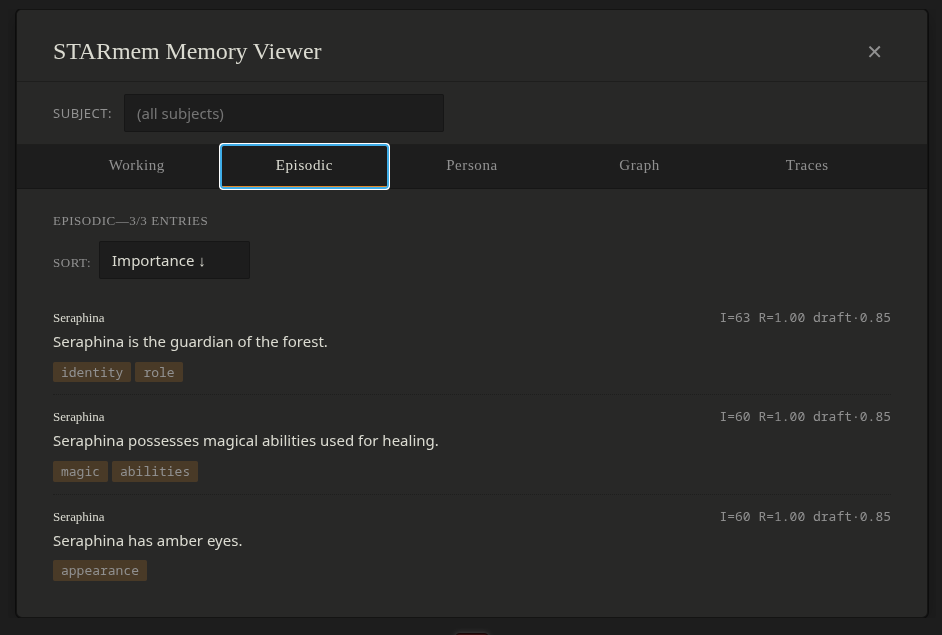

# STARmem

> A memory extension for SillyTavern—long-form roleplay and narrative
> chat. Deterministic retrieval, no LLM on the query path. Single-substrate
> context tree, async fact extraction, first-class benchmarking.

## Install

In SillyTavern:

1. Click the Extensions icon (puzzle piece, top bar).
2. Click "Install Extension" (top right of the Extensions panel).
3. Paste this URL: `https://github.com/EvaL3n4/SillyTavern-STARmem`
4. Click "Install".

For local-clone install (development), see [`docs/install.md`](docs/install.md).

## Features

- **Three memory scopes.** Working buffer (hot), Episodic (long-term),
  Persona (Enhanced-RAPTOR-distilled). Graph is infrastructure, not a
  memory.
- **Deterministic retrieval, always.** Tier 0 exact cache → Tier 1 fuzzy
  cache → Tier 3 intent-routed graph expansion (BM25-seeded). Floor:
  top-K by `recency × importance × maturity_boost`. **No LLM call on
  the query path. Ever.**
- **Single write path.** One `consolidate()` function, lazy-chained:
  Working → Episodic (triggered at buffer ≥ 10 or idle ≥ 60s) → Persona
  (explicit rebuild only).
- **Honest instrumentation.** Every retrieval produces a replayable
  trace; every consolidation produces a trace; the Memory Viewer
  surfaces both on a single timeline.
- **No vector DB. No embeddings. No sidecar files.** State lives in
  `chatMetadata['STARmem']`—rides ST's native backup.

## Configuration

Open the STARmem settings panel from ST's Extensions drawer:

- **Buffer size**—Working buffer threshold for consolidation
  (default: 10).
- **Idle timeout**—Seconds of silence before consolidation also fires
  (default: 60).
- **Connection profile**—Which ST connection profile to use for fact
  extraction. Used at write time only.

## Compatibility

- **Requires** SillyTavern 1.17.0+.
- **Tested on** Catppuccin, Midnight, and stock dark themes.

## Documentation

- [Design spec](docs/specs/2026-04-20-starmem-v2-design.md)—full
  architecture
- [Install guide](docs/install.md)—UI + local-clone paths
- [Research wiki](docs/wiki/)—paper-by-paper notes for adopted
  approaches
- [Implementation plans](docs/plans/)—phased rollout, retros per phase

## Citations

STARmem's design draws on published research:

**Adopted:**

- **ByteRover**—Nguyen et al. 2026, [arXiv:2604.01599](https://arxiv.org/abs/2604.01599)—substrate
  design (Context Tree, lifecycle metadata, tiered retrieval)
- **AdaMem**—Yan et al. 2026, [arXiv:2603.16496](https://arxiv.org/abs/2603.16496)—Working/Episodic/Persona
  vocabulary
- **MAGMA**—Jiang et al. 2026, [arXiv:2601.03236](https://arxiv.org/abs/2601.03236)—intent-routed
  graph expansion
- **Enhanced RAPTOR**—Liu et al. 2026, [DOI:10.3389/fcomp.2025.1710121](https://doi.org/10.3389/fcomp.2025.1710121)—Persona
  rebuild pipeline
- **RAPTOR**—Sarthi et al. 2024, [arXiv:2401.18059](https://arxiv.org/abs/2401.18059)—recursive
  abstractive tree

**Evaluated, not adopted:**

- **A-MEM**—Xu et al. 2025, [arXiv:2502.12110](https://arxiv.org/abs/2502.12110)—too weak on multi-hop for roleplay
- **Zep / Graphiti**—Rasmussen et al. 2025, [arXiv:2501.13956](https://arxiv.org/abs/2501.13956)—full KG engine is overkill at chat scale

## Contributions

Thank you to [adrenalvapor](https://github.com/adrenalvapor) for suggesting changes and live testing the SillyTavern implementation!

## License

Apache License 2.0—see [LICENSE](LICENSE).
